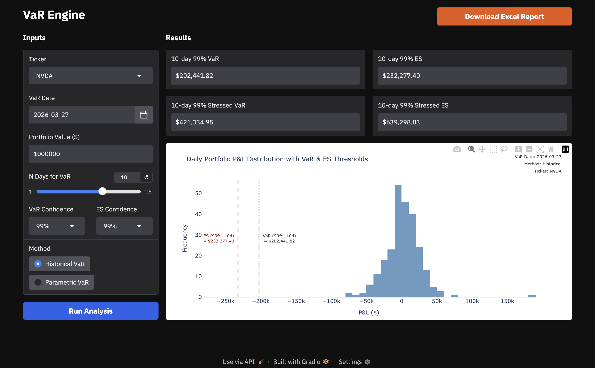

# VaR Engine

An interactive web app to compute **Value at Risk (VaR)** and **Expected Shortfall (ES)** for equities, featuring an interactive Gradio UI and **audit-ready Excel reports with embedded formulas**.



## Features

- **Interactive UI**: Sleek Gradio interface that dynamically updates on input changes.
- **Live Market Data**: Fetches historical prices via `yfinance`
- **Historical & Parametric VaR**: Supports both Historical and Parametric (variance-covariance) methods
- **Stressed VaR/ES**: Computes stressed metrics over a configurable stress window (e.g. GFC 2008)
- **Audit-Ready Excel**: Exports reports with **formula-driven calculations (no hardcoded outputs)**

## Getting Started

```bash
git clone https://github.com/kameshcodes/value-at-risk.git
cd value-at-risk
```

### Option 1: Using `uv` (Recommended)

1.  **Sync the environment**:
    ```bash
    uv sync
    ```
2.  **Run the application**:
    ```bash
    gradio app.py
    ```

### Option 2: Manual Setup (Pip)

1.  **Create and activate a virtual environment**:
    - **MacOS / Linux**:
      ```bash
      python3 -m venv .venv
      source .venv/bin/activate
      ```
    - **Windows**:
      ```powershell
      python -m venv .venv
      .venv\Scripts\activate
      ```

2.  **Install dependencies**:
    ```bash
    pip install -r requirements.txt
    ```

3.  **Run the application**:
    ```bash
    gradio app.py
    ```

The server will launch locally (typically at `http://127.0.0.1:7860` or `http://localhost:7860`). Open this address in your browser to access the VaR Engine.

## Project Structure

- **`app.py`**: The thin Gradio presentation/UI layer.
- **`src/`**: Core VaR calculation engine, data processing, and plotting logic.
- **`config.yaml`**: Application settings (tickers, lookback window, stress period).
- **`notebooks/`**: Jupyter notebooks for exploratory analysis (historical, parametric, Monte Carlo).
- **`log/`**: Persistent application logs managed by `loguru`.
- **`output/`**: Directory for exported Excel report files.


## Future Work

- **Multi-Asset Portfolio Support (In Progress)**: Extending from single equities to portfolios with configurable weights and aggregation of VaR/ES  
- **Asset Class Expansion (In Progress)**: Adding support for indices, ETFs, bonds, and other instruments  